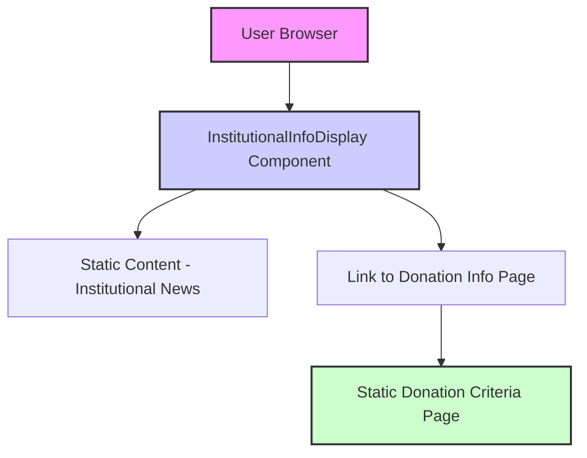

# Design Document: Institutional Information Display Feature

## Overview

This feature creates a simple, static information display section (cartelera informativa) for institutional news and announcements. The main requirement is to display information about the "Congreso Nacional Constituyente Obrero" with a "Leer más" link that opens a page about book donation criteria.

The feature addresses this specific requirement:
"14 Noviembre 2025InstitucionalConformación del Congreso Nacional Constituyente ObreroCumpliendo con el llamado a la patria con la clase obrera, se llevó a cabo la convocatoria para la Conformación del Congreso Nacional Constituyente Obrero dentro del Instituto Autónomo de Servicios de Bibliotecas e Información del Estado Bolivariano de Mérida, trabajadores y trabajadoras unidos participaron activamente y sin dilaciones en el proceso eleccionario de los Voceros y Voceras.Este es un llamado a la renovación profunda de nuestras estructuras, basado en las 7 grandes transformaciones impulsadas por nuestro Presidente Obrero Nicolás Maduro y el Gobernador Arnaldo Sánchez.Leer más, al desplegar leer mas debe abrir una pagina donde hable todo lo referente a la donacion de libros"

This is a **frontend-only implementation** - no backend, database, or complex services are required.

## Architecture

This feature consists of simple, static frontend components:



### Architecture Components

1. **Static Information Display**: A React component displaying institutional news content
2. **Link Component**: Simple hyperlink to donation information page
3. **Static Donation Page**: Simple HTML page with donation criteria information

## Components and Interfaces

### Component 1: InstitutionalInfoDisplay

**Purpose**: Simple component to display institutional news information with a "Leer más" link.

**Interface**:
```typescript
interface InstitutionalInfoDisplayProps {
  /**
   * Optional custom CSS class for styling
   */
  className?: string;
}

// This component has no state and no callbacks.
// It simply renders static content.
```

**Responsibilities**:
- Display the institutional news content about "Congreso Nacional Constituyente Obrero"
- Include date: "14 Noviembre 2025"
- Include category: "Institucional"
- Include title: "Conformación del Congreso Nacional Constituyente Obrero"
- Display the full text description
- Provide a "Leer más" link that opens the donation criteria page
- Use simple, clean styling

### Component 2: DonationInfoPage

**Purpose**: Simple static page showing donation criteria for library materials.

**Content**:
- Main title: "Criterios de donación para la aceptación de materiales Bibliohemerográficos en las Bibliotecas públicas"
- Key criterion: "Estado de conservación: Solo se aceptarán documentos en buen estado de conservación"
- Any additional relevant donation information

**Implementation Notes**:
- This is a static HTML/React page
- No backend or database required
- Can be linked to from the InstitutionalInfoDisplay component

## Static Content Structure

### Content for InstitutionalInfoDisplay

```typescript
const institutionalNewsContent = {
  date: "14 Noviembre 2025",
  category: "Institucional",
  title: "Conformación del Congreso Nacional Constituyente Obrero",
  description: `Cumpliendo con el llamado a la patria con la clase obrera, se llevó a cabo la convocatoria para la Conformación del Congreso Nacional Constituyente Obrero dentro del Instituto Autónomo de Servicios de Bibliotecas e Información del Estado Bolivariano de Mérida, trabajadores y trabajadoras unidos participaron activamente y sin dilaciones en el proceso eleccionario de los Voceros y Voceras.
  
  Este es un llamado a la renovación profunda de nuestras estructuras, basado en las 7 grandes transformaciones impulsadas por nuestro Presidente Obrero Nicolás Maduro y el Gobernador Arnaldo Sánchez.`,
  readMoreLink: "/donation-criteria", // or the appropriate route
  readMoreText: "Leer más"
};
```

### Content for DonationInfoPage

```typescript
const donationCriteriaContent = {
  mainTitle: "Criterios de donación para la aceptación de materiales Bibliohemerográficos en las Bibliotecas públicas",
  criteria: [
    {
      title: "Estado de conservación",
      description: "Solo se aceptarán documentos en buen estado de conservación",
      details: "Los materiales deben estar libres de daños graves como roturas, manchas, humedad, deterioro por insectos o páginas faltantes."
    },
    // Add more criteria as needed
  ],
  additionalInfo: "Para más información sobre el proceso de donación, contactar a la biblioteca durante el horario de atención."
};
```

## Simple Implementation Approach

### Component Rendering

```typescript
function InstitutionalInfoDisplay({ className }: InstitutionalInfoDisplayProps) {
  return (
    <div className={`institutional-info ${className}`}>
      <div className="info-date">14 Noviembre 2025</div>
      <div className="info-category">Institucional</div>
      <h2 className="info-title">Conformación del Congreso Nacional Constituyente Obrero</h2>
      
      <div className="info-content">
        <p>
          Cumpliendo con el llamado a la patria con la clase obrera, se llevó a cabo la 
          convocatoria para la Conformación del Congreso Nacional Constituyente Obrero dentro 
          del Instituto Autónomo de Servicios de Bibliotecas e Información del Estado 
          Bolivariano de Mérida, trabajadores y trabajadoras unidos participaron activamente 
          y sin dilaciones en el proceso eleccionario de los Voceros y Voceras.
        </p>
        <p>
          Este es un llamado a la renovación profunda de nuestras estructuras, basado en las 
          7 grandes transformaciones impulsadas por nuestro Presidente Obrero Nicolás Maduro 
          y el Gobernador Arnaldo Sánchez.
        </p>
      </div>
      
      <a href="/donation-criteria" className="read-more-link">
        Leer más
      </a>
    </div>
  );
}
```

**Key Characteristics**:
- Pure React component with no state
- Static content embedded directly
- Simple styling with CSS classes
- Standard anchor tag for navigation
- No backend dependencies

## Simple Static Page Example

### Donation Criteria Page

```typescript
function DonationCriteriaPage() {
  return (
    <div className="donation-criteria-page">
      <h1>Criterios de donación para la aceptación de materiales Bibliohemerográficos en las Bibliotecas públicas</h1>
      
      <div className="criteria-section">
        <h2>Estado de conservación</h2>
        <p className="key-criterion">Solo se aceptarán documentos en buen estado de conservación</p>
        
        <div className="details">
          <h3>¿Qué significa "buen estado de conservación"?</h3>
          <ul>
            <li>Libros sin roturas o páginas faltantes</li>
            <li>Documentos sin manchas de humedad o moho</li>
            <li>Material sin daños por insectos</li>
            <li>Encubiertas y lomos en buen estado</li>
            <li>Páginas legibles y completas</li>
          </ul>
        </div>
        
        <div className="additional-info">
          <h3>Otros criterios importantes</h3>
          <p>Los materiales deben ser relevantes para la colección de la biblioteca y adecuados para el público objetivo.</p>
          <p>Se aceptan libros, revistas, periódicos y otros materiales documentales.</p>
        </div>
        
        <div className="contact-info">
          <p>Para más información sobre el proceso de donación, por favor contactar a la biblioteca durante el horario de atención.</p>
        </div>
      </div>
    </div>
  );
}
```

## Example Usage

```typescript
// Example 1: Using the InstitutionalInfoDisplay component
import { InstitutionalInfoDisplay } from '@/components/institutional/InstitutionalInfoDisplay';

function HomePage() {
  return (
    <div className="container mx-auto p-4">
      <h1 className="text-2xl font-bold mb-4">Página Principal</h1>
      
      <div className="info-section mb-6">
        <InstitutionalInfoDisplay />
      </div>
      
      {/* Other page content */}
    </div>
  );
}

// Example 2: Using the DonationCriteriaPage component
import { DonationCriteriaPage } from '@/pages/DonationCriteriaPage';

function AppRoutes() {
  return (
    <Routes>
      <Route path="/" element={<HomePage />} />
      <Route path="/donation-criteria" element={<DonationCriteriaPage />} />
      {/* Other routes */}
    </Routes>
  );
}

// Example 3: Simple inline implementation (if you don't want separate components)
function SimpleInstitutionalInfo() {
  return (
    <div className="institutional-card p-4 border rounded-lg shadow-sm">
      <div className="text-sm text-gray-500">14 Noviembre 2025 • Institucional</div>
      <h2 className="text-xl font-bold mt-2">Conformación del Congreso Nacional Constituyente Obrero</h2>
      <div className="mt-3">
        <p className="mb-2">
          Cumpliendo con el llamado a la patria con la clase obrera, se llevó a cabo la 
          convocatoria para la Conformación del Congreso Nacional Constituyente Obrero...
        </p>
        <p>
          Este es un llamado a la renovación profunda de nuestras estructuras, basado en las 
          7 grandes transformaciones impulsadas por nuestro Presidente Obrero Nicolás Maduro 
          y el Gobernador Arnaldo Sánchez.
        </p>
      </div>
      <a 
        href="/donation-criteria" 
        className="inline-block mt-4 px-4 py-2 bg-blue-600 text-white rounded hover:bg-blue-700"
      >
        Leer más
      </a>
    </div>
  );
}
```

## Correctness Properties

### Property 1: Content Accuracy
**The displayed text must match exactly the provided institutional news content**, including date, category, title, and description text. **Validates: Requirements FR1**

### Property 2: Link Functionality
**The "Leer más" link must correctly navigate to the donation criteria page** when clicked, without causing JavaScript errors or page reload issues. **Validates: Requirements FR1**

### Property 3: Accessibility Compliance
**All elements must meet WCAG 2.1 AA compliance standards**, including proper heading structure, link text, and color contrast ratios. **Validates: Requirements NFR2**

### Property 4: Responsive Display
**The component must render correctly on mobile, tablet, and desktop screens** without horizontal scrolling or overlapping content. **Validates: Requirements FR1**

### Property 5: No Backend Dependencies
**The implementation must not require backend services, databases, or external APIs**, all content must be static and self-contained. **Validates: Technical Constraints TC1.4**

## Error Scenarios

### Scenario 1: Broken Link
**Condition**: The "Leer más" link points to a non-existent route
**Response**: Standard 404 page or routing error (handled by the router)
**Recovery**: Ensure the route is properly defined in the application router

### Scenario 2: CSS Loading Issues
**Condition**: Styling fails to load or apply correctly
**Response**: Component renders with basic browser defaults (still functional)
**Recovery**: Use inline styles or ensure CSS files are properly included

### Scenario 3: JavaScript Disabled
**Condition**: User has JavaScript disabled in browser
**Response**: Simple HTML content still displays and links work
**Recovery**: Ensure component renders meaningful HTML without JavaScript

### Scenario 4: Mobile Display Issues
**Condition**: Component doesn't render well on small screens
**Response**: User experiences suboptimal but still functional display
**Recovery**: Test with responsive design tools and adjust CSS as needed

## Testing Strategy

### Simple Component Testing

**Component Tests**: Test rendering of static content
- Test that all required text content is present
- Test that the "Leer más" link has correct href
- Test basic accessibility attributes
- Test component renders without errors

**Example Test**:
```typescript
test('InstitutionalInfoDisplay renders all required content', () => {
  render(<InstitutionalInfoDisplay />);
  
  // Check date
  expect(screen.getByText('14 Noviembre 2025')).toBeInTheDocument();
  
  // Check category
  expect(screen.getByText('Institucional')).toBeInTheDocument();
  
  // Check title
  expect(screen.getByText('Conformación del Congreso Nacional Constituyente Obrero')).toBeInTheDocument();
  
  // Check key phrases in description
  expect(screen.getByText(/Cumpliendo con el llamado a la patria/)).toBeInTheDocument();
  expect(screen.getByText(/renovación profunda de nuestras estructuras/)).toBeInTheDocument();
  
  // Check "Leer más" link
  const readMoreLink = screen.getByText('Leer más');
  expect(readMoreLink).toHaveAttribute('href', '/donation-criteria');
});
```

### Visual Regression Testing

**Screenshot Tests**: Ensure consistent visual appearance
- Test component appearance on different screen sizes
- Verify color contrast meets accessibility standards
- Ensure responsive design works correctly

### Integration Testing

**Route Testing**: Test navigation flow
- Test clicking "Leer más" navigates to correct page
- Test donation criteria page loads and displays content

## Performance Considerations

### Minimal Performance Impact
- **Small Bundle Size**: Component adds minimal JavaScript/HTML
- **No External Dependencies**: No API calls, database queries, or network requests
- **Fast Rendering**: Static content renders instantly
- **No State Management**: No complex state or lifecycle to manage

### Optimization Not Needed
- **No Caching Required**: Content is static and embedded
- **No Lazy Loading**: Component is simple and lightweight
- **No Bundle Splitting**: Component is small enough to include in main bundle
- **No Database Queries**: All content is hard-coded

## Security Considerations

### Minimal Security Requirements
- **No User Input**: Component doesn't accept or process user input
- **No Data Storage**: No personal data is collected or stored
- **No Authentication**: No user authentication required
- **No External Requests**: No API calls to external services

### Basic Security
- **Safe Content**: All content is static and trusted
- **Standard Links**: Uses standard HTML anchor tags for navigation
- **No Script Injection**: Content is hard-coded, not dynamically generated

## Dependencies

### Minimal Dependencies
- **React**: For component rendering (already in project)
- **TypeScript**: For type safety (already in project)
- **CSS**: For basic styling (already in project)
- **Routing Library**: For navigation links (already in project)

### No Dependencies Needed
- **No Backend Services**: No Express, Supabase, Redis, or databases
- **No External APIs**: No translation services or external data sources
- **No Complex Libraries**: No state management, data fetching, or complex UI libraries beyond what's already in the project