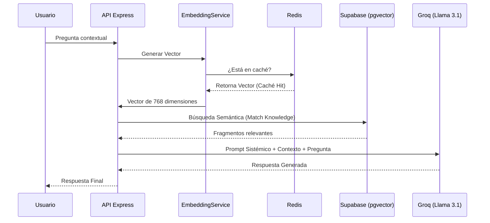

# Arquitectura del Sistema 🏗️

Este documento detalla el diseño técnico y los patrones arquitectónicos utilizados en **IBIME Connect**.

## 🏛️ Filosofía de Diseño
El sistema sigue los principios de **Arquitectura Limpia (Clean Architecture)** y **SOLID**, separando las preocupaciones en capas bien definidas para maximizar la testabilidad y el desacoplamiento de servicios externos.

## 🧱 Estructura del Backend (Modular Monolith)

El backend está organizado en las siguientes capas dentro de `backend/src`:

1.  **Domain (Interfaces)**: Define los contratos de los servicios. Es el núcleo de la lógica y no tiene dependencias externas.
2.  **Infrastructure (Implementaciones)**: Contiene los detalles técnicos (Conexión a Redis, Repositorio de Supabase, Proveedor de Groq).
3.  **Services**: Orquestan la lógica de negocio consumiendo interfaces.
4.  **Controllers**: Manejan la comunicación HTTP y la validación de entrada (Zod).

### 💉 Inyección de Dependencias (DI)
Utilizamos `tsyringe` para gestionar el ciclo de vida de los servicios. Los controladores no instancian sus servicios; los reciben por constructor.
- **Beneficio**: Permite intercambiar un proveedor (ej: cambiar Groq por OpenAI) simplemente modificando la configuración del contenedor en `infrastructure/di/container.ts`.

## 🤖 Flujo del Motor RAG
El sistema de generación aumentada por recuperación (RAG) funciona siguiendo este flujo:

## ⚡ Estrategia de Caché (Redis)
Para optimizar latencia y costos de API, implementamos una capa de caché inteligente:
- **Embeddings**: Almacenados por 24 horas. Es la operación más frecuente y lenta.
- **Resultados RAG**: Almacenados por 1 hora. Evita procesar la misma consulta institucional repetidamente.
- **Resiliencia (Graceful Degradation)**: En caso de caídas de conexión con Redis Cloud, el sistema detecta protocolos `tls` de manera dinámica y está programado para evadir bucles infinitos de crasheo. El backend seguirá operando sin caché de manera estabilizada antes de tumbar el servicio integral.

## 📊 Observabilidad
Cada solicitud genera un `requestId` único. Este ID se propaga a través de todos los logs estructurados (Pino), permitiendo rastrear el comportamiento del sistema ante una consulta específica en producción.

---
*Diseñado para la excelencia técnica y el servicio ciudadano.*
