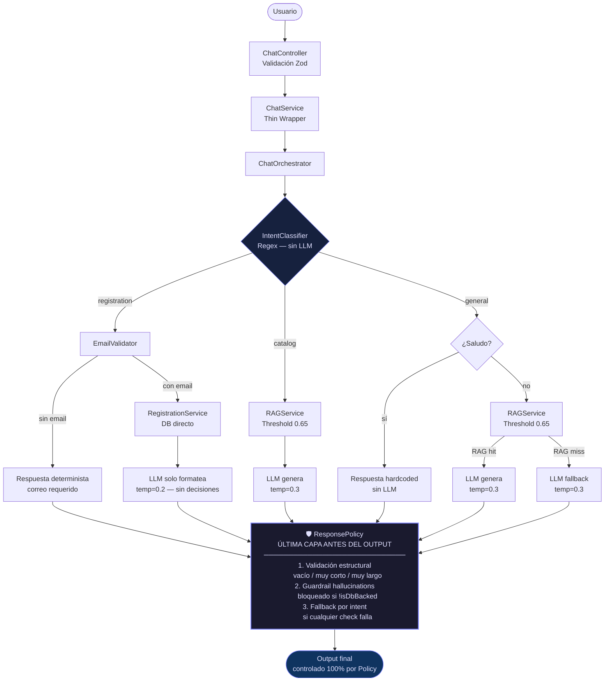

# Arquitectura del Sistema 🏗️

Este documento detalla el diseño técnico y los patrones arquitectónicos utilizados en **IBIME Connect**.

## 🏛️ Filosofía de Diseño
El sistema sigue los principios de **Arquitectura Limpia (Clean Architecture)** y **SOLID**, separando las preocupaciones en capas bien definidas para maximizar la testabilidad y el desacoplamiento de servicios externos.

## 🧱 Estructura del Backend (Modular Monolith)

El backend está organizado en las siguientes capas dentro de `backend/src`:

1. **Domain (Interfaces)**: Define los contratos de los servicios. Es el núcleo de la lógica y no tiene dependencias externas.
2. **Infrastructure (Implementaciones)**: Contiene los detalles técnicos (Conexión a Redis, Repositorio de Supabase, Proveedor de Groq).
3. **Modules/Chat**: Contiene toda la lógica del motor de chat (Orchestrator, Classifier, Policy, Guardrail).
4. **Services**: Orquestan la lógica de negocio consumiendo interfaces.
5. **Controllers**: Manejan la comunicación HTTP y la validación de entrada (Zod).

---

## 🤖 Arquitectura del Motor de Chat (Determinista + RAG)

El motor de chat implementa una **cadena de responsabilidad lineal y determinista**. El LLM nunca controla el flujo ni el output final.

### Principio fundamental
> El LLM **nunca** es la última capa. `ResponsePolicy` es la única fuente de verdad para el output final.

---

## 🔐 Capas de Seguridad del Motor de Chat

El sistema implementa defensas en **tres niveles independientes** para prevenir alucinaciones:

| Capa | Módulo | Responsabilidad |
|:---|:---|:---|
| **1 — Pre-LLM** | `IntentClassifier` | Routing determinista sin LLM. El modelo no decide el flujo. |
| **2 — Pre-LLM** | `RAGService` (threshold 0.65) | Fail-hard: si similitud < 0.65, rechaza todos los resultados. Sin datos de baja calidad al LLM. |
| **3 — Post-LLM** | `ResponseGuardrail` | Detecta y bloquea alucinaciones de estado de usuario (inscripciones, registros, cuentas). |
| **4 — Post-LLM** | `ResponsePolicy` | Validación estructural + guardrail + fallbacks por intent. Última puerta antes del output. |

### Módulos del Motor de Chat (`src/modules/chat/`)

| Archivo | Rol |
|:---|:---|
| `intent-classifier.ts` | Clasificación regex determinista. `registration` / `catalog` / `general`. Sin LLM. |
| `email-validator.ts` | Validación estricta RFC antes de cualquier query a DB. |
| `chat-orchestrator.ts` | Routing y coordinación de todos los flujos. Fuente de verdad del control de flujo. |
| `system-prompt.ts` | Prompt minimalista: solo rol, datos institucionales y reglas. Sin lógica de negocio. |
| `response-guardrail.ts` | Patrones regex que detectan alucinaciones de user-state. |
| `response-policy.ts` | **Última capa.** Validación estructural + guardrail + fallbacks por intent. |

---

## 💉 Inyección de Dependencias (DI)
Utilizamos `tsyringe` para gestionar el ciclo de vida de los servicios. Los controladores no instancian sus servicios; los reciben por constructor.
- **Beneficio**: Permite intercambiar un proveedor (ej: cambiar Groq por OpenAI) simplemente modificando la configuración del contenedor en `infrastructure/di/container.ts`.

---

## ⚡ Estrategia de Caché (Redis)
Para optimizar latencia y costos de API, implementamos una capa de caché inteligente:
- **Embeddings**: Almacenados por 24 horas. Es la operación más frecuente y lenta.
- **Resultados RAG**: Almacenados por 1 hora. Evita procesar la misma consulta institucional repetidamente.
- **Resiliencia (Graceful Degradation)**: En caso de caídas de conexión con Redis Cloud, el sistema detecta protocolos `tls` de manera dinámica y está programado para evadir bucles infinitos de crasheo. El backend seguirá operando sin caché de manera estabilizada antes de tumbar el servicio integral.

---

## 📊 Observabilidad
Cada solicitud genera un `requestId` único. Este ID se propaga a través de todos los logs estructurados (Pino), permitiendo rastrear el comportamiento del sistema ante una consulta específica en producción.

---
*Diseñado para la excelencia técnica y el servicio ciudadano.*
