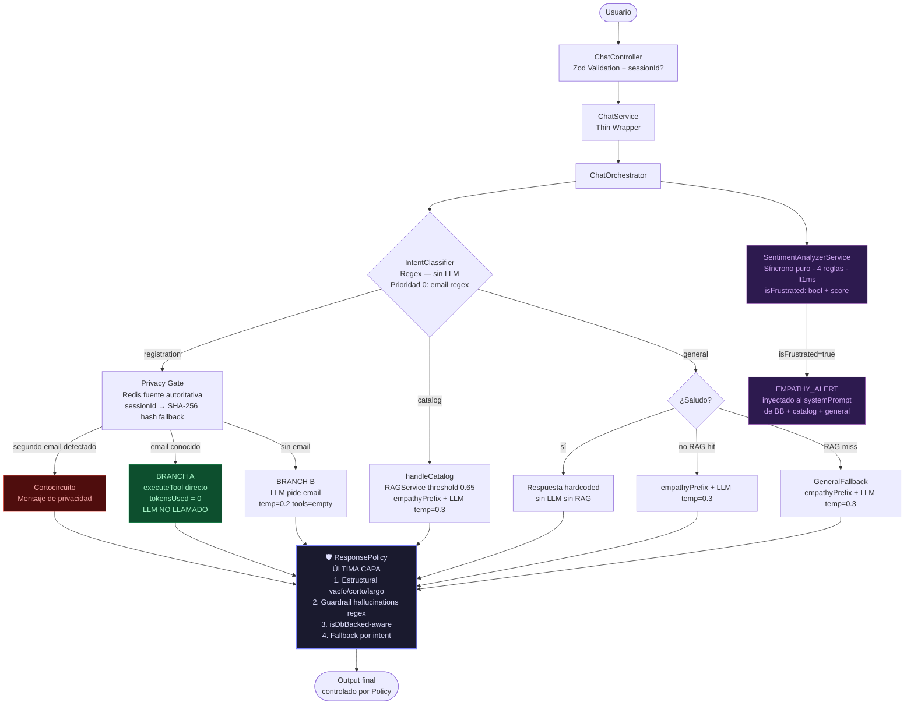

# Arquitectura del Sistema 🏗️

**IBIME Connect** — Arquitectura Híbrida Determinista/Probabilística v2.0

---

## 🏛️ Filosofía de Diseño

El sistema sigue **Clean Architecture** y **SOLID**. La premisa central es: el LLM es un formateador de texto, no un árbitro de decisiones de negocio. Toda decisión de routing, validación de seguridad y formateo final es responsabilidad del sistema, no del modelo.

**Invariante de producción**: Una alucinación que afirme a un ciudadano "no estás inscrito" cuando sí lo está genera desconfianza institucional irreversible. Por este motivo, el LLM es excluido físicamente del camino crítico cuando se cuenta con datos verificados.

---

## 🧱 Capas del Backend

| Capa | Directorio | Responsabilidad |
|:---|:---|:---|
| **Domain** | `domain/` | Contratos (interfaces). Cero dependencias externas. |
| **Infrastructure** | `infrastructure/` | Redis, Supabase, Groq, logger, DI container. |
| **Modules/Chat** | `modules/chat/` | Motor de IA: orquestador, clasificador, guardrail, policy. |
| **Services** | `services/` | Lógica de negocio + servicios de IA (RAG, SessionMemory, Sentiment). |
| **Controllers** | `controllers/` | HTTP handlers. Validan con Zod, delegan, responden. |

---

## 🤖 Arquitectura del Motor de Chat



---

## 🔐 Privacy Gate — Memoria de Sesión con Redis

El Privacy Gate opera **antes** de Branch A y Branch B para blindar el flujo de inscripciones contra ataques de email-switching (intentar consultar inscripciones de otro usuario en la misma sesión).

### Jerarquía de fuentes (mayor → menor confianza)

```
1. Redis  →  sessionMemory.getSessionContext(effectiveSessionId)   ← AUTORITATIVA
2. conversationHistory[]  (enviado por el cliente)                 ← FALLBACK
3. Mensaje actual del usuario                                      ← PRIMERA APARICIÓN
```

### Identificación de sesión

```typescript
// Si el frontend envía UUID → se usa directamente
// Si no → hash estable del primer mensaje del historial
const effectiveSessionId = sessionId
  ?? (conversationHistory.length > 0
    ? createHash('sha256').update(history[0].text.slice(0, 200)).digest('hex').slice(0, 24)
    : null);
```

### Flujo

```
getSessionContext(effectiveSessionId)
  │
  ├── serverEmail encontrado → es la verdad absoluta
  │     ├── emailInCurrentMessage === serverEmail → Branch A o B normalmente
  │     └── emailInCurrentMessage !== serverEmail → CORTOCIRCUITO (privacidad)
  │
  └── serverEmail = null → busca en conversationHistory
        ├── email encontrado en history → usa ese
        └── sin email en history → Branch B (pide email al usuario)
              └── al capturar email → saveSessionContext(id, { firstEmail })
                                       TTL: 30 minutos
```

---

## 🧠 SentimentAnalyzerService — Inteligencia Emocional

### Principio de diseño

Función **pura y síncrona** sin I/O. Ejecuta en <1ms. Jamás bloquea Branch A. El orquestador solo consume `{ isFrustrated: boolean, score: number }`.

### 4 Reglas Heurísticas

```typescript
// Umbral de frustración: score >= 2

// Regla 1: Mayúsculas sostenidas (>70% letras en caps, msg >6 chars) → +2
// Ejemplo: "NO ENTIENDO NADA" → score +2 → isFrustrated: true

// Regla 2: Patrones de alta señal → +2 c/u
// 'pésimo' | 'es un asco' | 'horrible' | 'terrible' | 'mal servicio'
// 'harto'  | 'no funciona' | 'no sirve' | 'desesperado'

// Regla 3: Patrones de señal media → +1 c/u
// 'humano' | 'ayuda' | 'error' | 'no entiendo' | 'no puedo' | 'urgente'
// Nota: 'ayuda' solo = score 1 (no frustrado). Necesita otra señal.

// Regla 4: Abuso de signos (3+) → +2
// '!!!' | '???' → score +2 → isFrustrated: true
```

### Inyección en el prompt (solo flujos LLM)

```
Branch A (DB directo)  → completamente INMUNE (LLM no se llama)
Branch B               → EMPATHY_ALERT + CHAT_SYSTEM_PROMPT + RAG
handleCatalog          → EMPATHY_ALERT + CHAT_SYSTEM_PROMPT + RAG
handleGeneral          → EMPATHY_ALERT + CHAT_SYSTEM_PROMPT + RAG
handleGeneralFallback  → EMPATHY_ALERT + CHAT_SYSTEM_PROMPT + Nota
```

---

## 🛡️ 5 Capas de Seguridad Anti-Alucinación

| # | Tipo | Módulo | Descripción |
|:---:|:---|:---|:---|
| 1 | **Pre-LLM** | `intent-classifier.ts` | Routing regex. Prioridad 0: detecta emails en cualquier mensaje. |
| 2 | **Pre-Branch A/B** | `session-memory.service.ts` | Redis como fuente autoritativa del email. Bloquea email-switching. |
| 3 | **Pre-LLM** | `rag.service.ts` | Fail-hard: similitud < 0.65 → contexto rechazado. |
| 4 | **Post-LLM** | `response-guardrail.ts` | 10 patrones regex bloquean alucinaciones de user-state. |
| 5 | **Post-LLM** | `response-policy.ts` | Última puerta: estructural + guardrail + fallbacks por intent. |

### Módulos del Motor de Chat

| Archivo | Rol |
|:---|:---|
| `chat-orchestrator.ts` | Orquestador central. Inyecta sentiment, Privacy Gate, Branch A/B. |
| `intent-classifier.ts` | Clasificación regex. Prioridad 0: regex email → `registration`. |
| `response-guardrail.ts` | Post-LLM: 10 patrones regex detectan alucinaciones. |
| `response-policy.ts` | Última capa: validación estructural + guardrail + fallbacks. |
| `system-prompt.ts` | Prompt institucional hardened (sin lógica de negocio). |
| `email-validator.ts` | Validación RFC antes de cualquier query a DB. |

### Servicios Auxiliares del Motor

| Archivo | Rol |
|:---|:---|
| `session-memory.service.ts` | Estado de sesión autoritativo via Redis. TTL: 30 min. |
| `sentiment-analyzer.service.ts` | Análisis emocional síncrono. 4 reglas heurísticas. |

---

## 💉 Inyección de Dependencias (tsyringe)

El contenedor registra todos los singletons. El orquestador recibe sus dependencias por constructor con `@inject`:

```typescript
@injectable()
export class ChatOrchestrator {
  constructor(
    private llmProvider: ILLMProvider,
    private ragService: RAGService,
    @inject('SessionMemoryService')  private sessionMemory:     SessionMemoryService | null = null,
    @inject('SentimentAnalyzerService') private sentimentAnalyzer: SentimentAnalyzerService | null = null
  )
}
```

**Graceful degradation**: si Redis no está disponible, `sessionMemory = null` → el Privacy Gate cae al historial del cliente. Si `sentimentAnalyzer = null` → `isFrustrated = false` siempre. El sistema nunca crashea por estas dependencias opcionales.

> **Nota de testing**: Los decoradores `@injectable`/`@inject` requieren `reflect-metadata`. El polyfill está en `src/__tests__/setup.ts`, registrado en `vitest.config.ts` como `setupFiles`.

---

## ⚡ Estrategia de Caché Redis (Dual Purpose)

Redis cumple **dos roles** en el sistema:

| Uso | Clave | TTL | Responsable |
|:---|:---|:---|:---|
| **Embeddings** | `embed:{hash}` | 24h | `CacheService` |
| **Resultados RAG** | `rag:{hash}` | 1h | `CacheService` |
| **Contexto de sesión** | `ibime:session:{id}` | 30 min | `SessionMemoryService` |

**Resiliencia**: conexión TLS detectada automáticamente (`rediss://` vs `redis://`). Reconexión con backoff exponencial (máx 5 reintentos). Timeout agresivo → el backend continúa sin caché.

---

## 🔐 Seguridad HTTP / Transporte

Complementa las 5 capas anti-alucinación con defensas a nivel de petición:

| Mecanismo | Módulo | Rol |
|:---|:---|:---|
| **`helmet`** | `app.ts` | Cabeceras de seguridad (nosniff, frameguard, HSTS, sin `X-Powered-By`). |
| **`trust proxy`** | `app.ts` | `req.ip` real detrás del proxy de Render → el rate-limiting por IP funciona y no es evadible vía `X-Forwarded-For`. |
| **Rate limiting** | `app.ts`, `api.routes.ts` | Límites por endpoint (chat, api, admin) con `express-rate-limit`. |
| **`requireAdminKey`** | `admin-auth.middleware.ts` | Guard timing-safe (SHA-256 + `timingSafeEqual`) para endpoints administrativos e ingesta. |
| **RLS (Supabase)** | `supabase/migrations/` | `anon` sin escritura; solo `service_role` (backend) muta las tablas de PII. `SELECT` restringido a `authenticated`. |
| **Verificación de propiedad** | `check_registration.tool.ts` | Exige `email` + `phone` coincidente antes de revelar inscripciones; respuesta genérica anti-enumeración. |

---

## 📊 Observabilidad

Cada petición genera un `requestId` único propagado a todos los logs (Pino JSON). El Privacy Gate emite logs diferenciados:

```json
{ "level": 30, "msg": "Privacy Gate inputs", "effectiveSessionId": "...", "serverEmail": "...", "emailInCurrentMessage": "..." }
{ "level": 30, "msg": "Privacy Gate: email saved to session store", "sessionId": "...", "email": "..." }
{ "level": 40, "msg": "Privacy gate triggered: second email detected", "firstEmail": "...", "newEmail": "..." }
{ "level": 30, "msg": "BRANCH A — direct tool call, LLM bypassed entirely", "email": "..." }
{ "level": 30, "msg": "Sentiment: user appears frustrated", "sentimentScore": 4 }
```

### Trazas y alertas

- **LangSmith** (`observability/tracing.ts`): instrumenta el pipeline de chat con sanitización de PII. No-op sin `LANGSMITH_API_KEY`.
- **Sentry** (`observability/sentry.ts`): captura los errores 500 reales (nunca 4xx/429) y **alerta cuando se agota la cuota diaria de Groq** (`tpd`/`rpd`, con dedup en Redis: una alerta por día). No-op sin `SENTRY_DSN`, `sendDefaultPii: false`. Ambos siguen el patrón de degradación elegante: sin la clave, la app funciona idéntica.

---

## 📚 Pipeline RAG (Ingesta de Conocimiento)

1. **Entrada**: PDF via `POST /api/v1/knowledge/upload-pdf` o Webhook Koha.
2. **Procesamiento en memoria** (Multer — nunca toca disco efímero de Render).
3. **Chunking semántico**: ~1000 chars con 200 de overlap respetando límites de oración.
4. **Vectorización**: Google Gemini (`gemini-embedding-001`, 768 dims).
5. **Almacenamiento**: Supabase `knowledge_base` con índice HNSW.
6. **Búsqueda**: RPC `match_knowledge` con threshold fail-hard 0.65.

**Separación de responsabilidades**:
- **System prompt (RAM)**: identidad estática (nombre, horarios, misión) → 0 alucinaciones.
- **pgvector (DB)**: conocimiento denso y extenso → recuperado on-demand.

---

*Diseñado para la excelencia técnica y el servicio ciudadano.*
